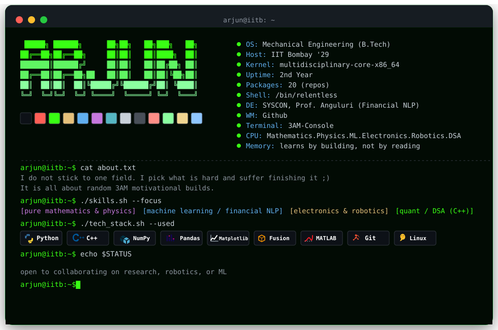

<div align="center">



</div>

---

### `$ github --stats`

<div align="center">
  
  
</div>

<div align="center">
  
</div>

---

### `$ leetcode --stats`

<div align="center">
  <a href="https://leetcard.jacoblin.cool/napoleonictrafficcone08">
    
  </a>
</div>

---

### `$ ./contribution_snake.sh`

<div align="center">
  
</div>

---

<div align="center">

```
arjun@iitb:~$ echo $MOTTO
"if it runs, ship it. if it doesn't, debug until it does."
```

📫 reach me on <a href="https://www.linkedin.com/in/arjun-pawar-959177277/">LinkedIn</a> · 🌐 <a href="https://arjunpawar2007ap-arch.github.io/Portfolio_site/">portfolio</a>

</div>
